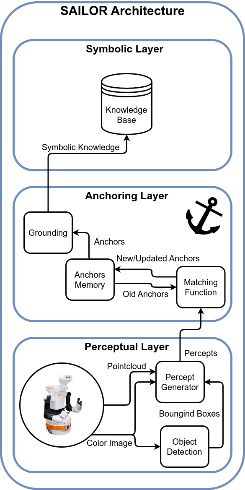

# SAILOR (Symbolic AnchorIng from perceptuaL for rOs2-based Robots)

<p align="center">
  
</p>

## Dependencies

- [simple_node](https://github.com/uleroboticsgroup/simple_node)
- [kant](https://github.com/uleroboticsgroup/kant)
- [yolov8_ros](https://github.com/mgonzs13/yolov8_ros)
- [ros2_asus_xtion](https://github.com/mgonzs13/ros2_asus_xtion) (only for demo)

## Installation

```shell
# repos
$ cd ~/ros2_ws/src
$ git clone https://github.com/MERLIN2-ARCH/sailor
$ pip3 install -r sailor/requirements.txt
$ cd ~/ros2_ws
$ colcon build
```

## Demo

```shell
$ ros2 launch sailor_bringup sailor.launch.py
```

```shell
$ ros2 service call /get_objects kant_interfaces/srv/GetPddlObject {}
```

## Citations

```bibtex
@misc{gonzálezsantamarta2023sailor,
      title={SAILOR: Perceptual Anchoring For Robotic Cognitive Architectures},
      author={Miguel Á. González-Santamarta and Francisco J. Rodríguez-Lera and Vicente Matellán Olivera},
      year={2023},
      eprint={2303.08204},
      archivePrefix={arXiv},
      primaryClass={cs.RO}
}
```
